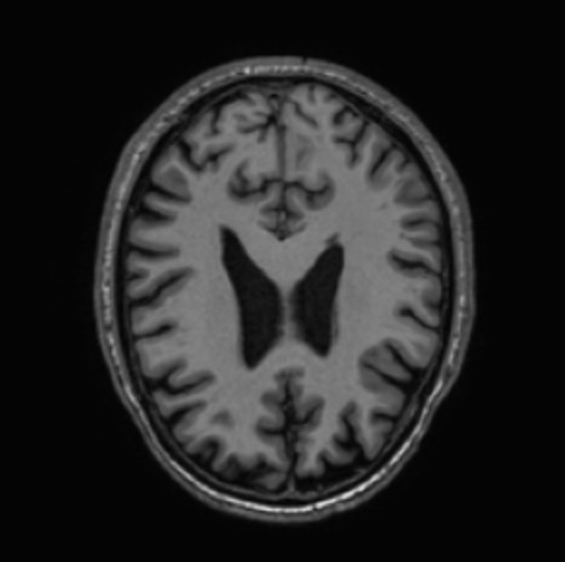
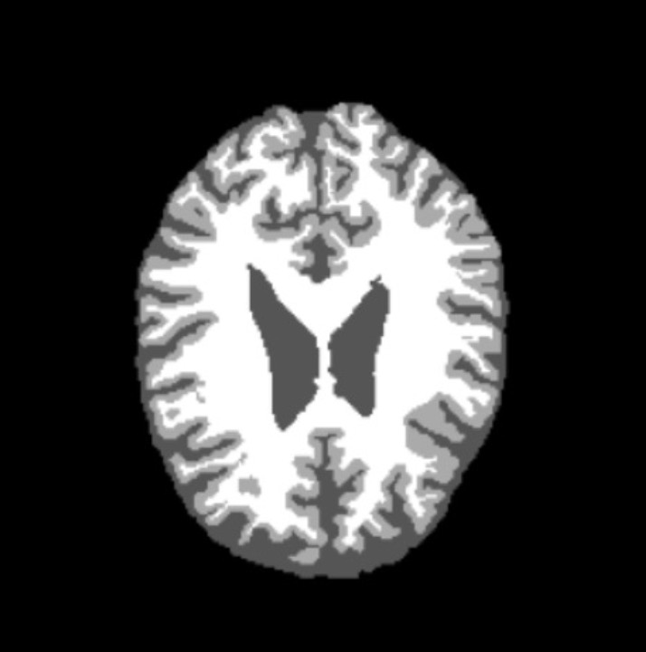
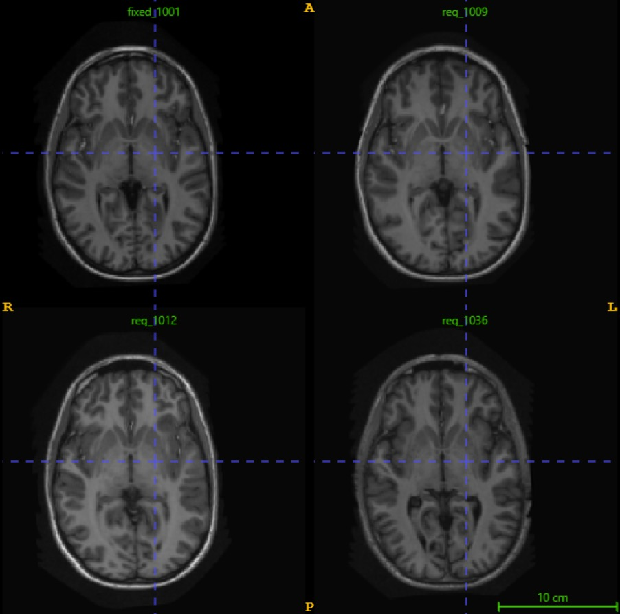
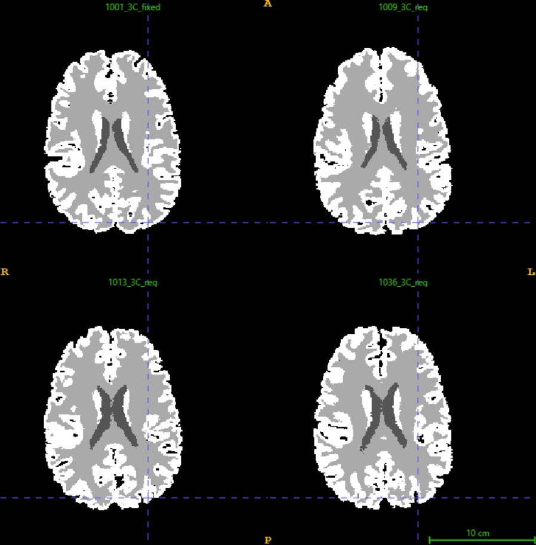
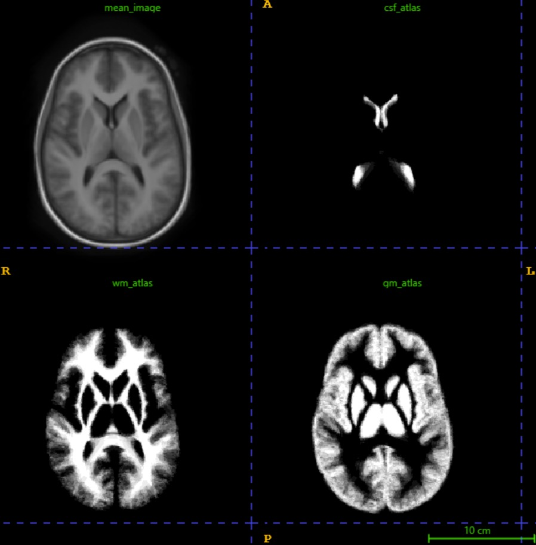
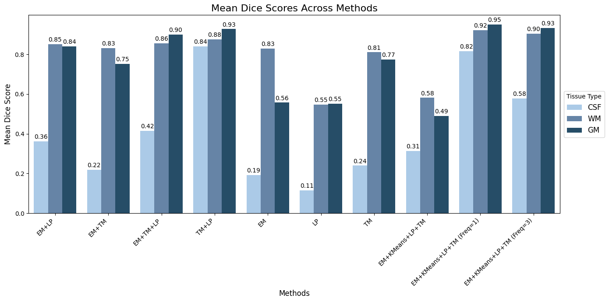
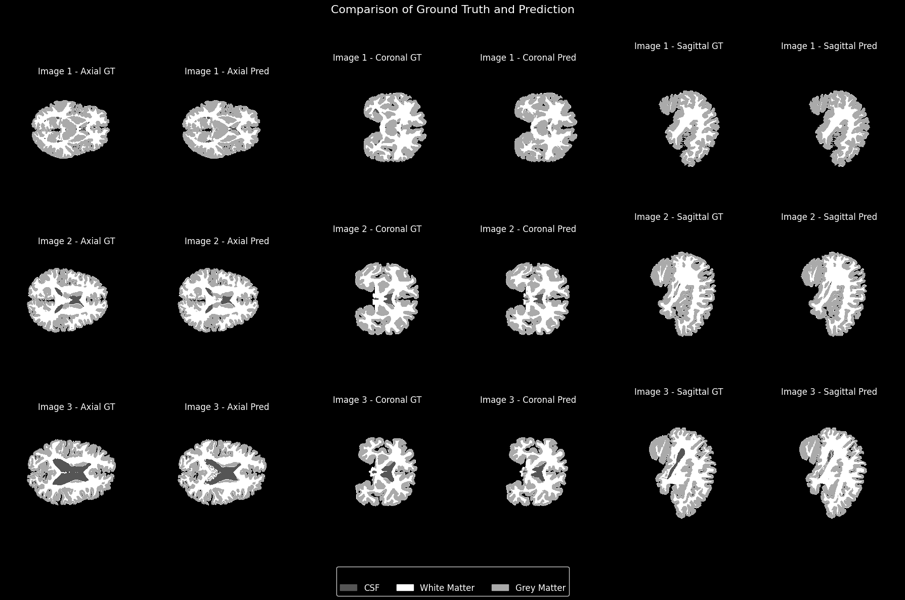

# Brain Tissue Segmentation Using GMM and Atlas-based Methods

This project explores the segmentation of brain tissues into **Grey Matter (GM)**, **White Matter (WM)**, and **Cerebrospinal Fluid (CSF)** from MRI scans using a combination of **Gaussian Mixture Models (GMM)** and **Atlas-based techniques**. The study evaluates multiple initialization strategies, compares segmentation approaches, and assesses performance through Dice similarity and Balanced Accuracy metrics.

---

## **Abstract**

- **Objective:** Accurate segmentation of brain tissues for better diagnosis and treatment planning in neurological conditions.
- **Approach:** Combining GMM with probabilistic atlases and tissue models to improve segmentation accuracy.
- **Results:** Integration of GMM with atlas-based methods and tissue models enhances segmentation performance, though generalizability to diverse datasets may be limited.

---

## **Dataset**
- **Size:** 20 T1-weighted MRI scans and corresponding ground truth segmentation masks for WM, GM, and CSF.
<table>
  <tr>
    <td style="text-align: center;">
      
      
<b>Figure 1:</b> T1 Weighted MRI Scan

    </td>
    <td style="text-align: center;">
      
      
<b>Figure 2:</b> Corresponding Ground Truth

    </td>
  </tr>
</table>
- **Format:** Intensity-based and spatial data for probabilistic atlas and tissue model creation.

---

## **Methodology**

### **1. Registration**
- **Atlas Registration:**
  - Performed affine and B-spline registration using itk-elastix.
  - Metrics: Mattes Mutual Information and gradient descent optimizations.
  - Results: Mean image and probabilistic atlas created from registered labels.
- **Label Propagation:**
  - Applied transformations to labels for creating the probabilistic atlas.
 
<table>
  <tr>
    <td style="text-align: center;">
      
      
<b>Figure 1:</b> Registered Image

    </td>
    <td style="text-align: center;">
      
      
<b>Figure 2:</b> Registered Masks

    </td>
    <td style="text-align: center;">
      
      
<b>Figure 3:</b> Mean Image and Probabilistic Atlas

    </td>
  </tr>
</table>

### **2. Tissue Models**
- **Intensity Normalization:** Min-Max normalization to [0, 255].
- **Probability Distributions:** Histograms smoothed using Gaussian filters and saved for tissue modeling.

### **3. Segmentation Approaches**
1. **Tissue Models:** Voxel intensity data mapped to tissue types based on probability.
2. **Probabilistic Atlas:** Spatial pixel information segmented using atlas probabilities.
3. **Combined Approach:** Multiplication of tissue probabilities and atlas probabilities for refined segmentation.
4. **GMM Integration:**
   - Initialization Methods:
     - K-Means
     - Tissue Models
     - Probabilistic Atlas
     - Combined Atlas and Tissue Models
   - Improvements:
     - Faster convergence using Cholesky decomposition.
     - Convergence criteria: Empirical threshold of \( \epsilon = 10^{-6} \).

---

## **Results**

### **Metrics**
- **Dice Score (DSC):** Measures overlap between predicted and ground truth masks.
- **Balanced Accuracy (BA):** Averages sensitivity and specificity.

### **Quantitative Results**
| Method                  | CSF    | WM     | GM     | Average |
|-------------------------|--------|--------|--------|---------|
| EM+TM+LP                | 0.4152 | 0.8551 | 0.9002 | 0.7235  |
| TM+LP                   | 0.8392 | 0.8785 | 0.9269 | 0.8061  |
| EM+KMeans+LP+TM (Freq=1)| 0.8154 | 0.9219 | 0.9502 | 0.8958  |

- **Best Approach:** EM+KMeans+LP+TM (Freq=1) with highest Dice scores for all tissues.
- **Challenges:** Lower Dice scores for CSF due to intensity overlaps with GM and minority class representation.

### **Qualitative Results**
- Visual comparisons indicate improved segmentation using combined approaches.

---

## **Discussion**

### **Key Findings**
- **Spatial Information:** Inclusion improves segmentation accuracy, particularly for CSF.
- **Initialization Comparison:** EM+TM+LP outperforms standalone EM or TM approaches.
- **Tissue Type Performance:** CSF segmentation challenges due to low intensity and small region representation.

### **Future Work**
- Explore deep learning-based segmentation.
- Improve CSF segmentation through hybrid techniques.

---

## **References**
1. Klein, S., et al. *"elastix: A Toolbox for Intensity-Based Medical Image Registration"*. IEEE Transactions on Medical Imaging, 29(1), 2010. [DOI](https://doi.org/10.1109/TMI.2009.2035616)
2. Mulder, I. A., et al. *"Automated Ischemic Lesion Segmentation in MRI Mouse Brain Data"*. Frontiers in Neuroinformatics, 11, 2017. [DOI](https://doi.org/10.3389/fninf.2017.00003)

